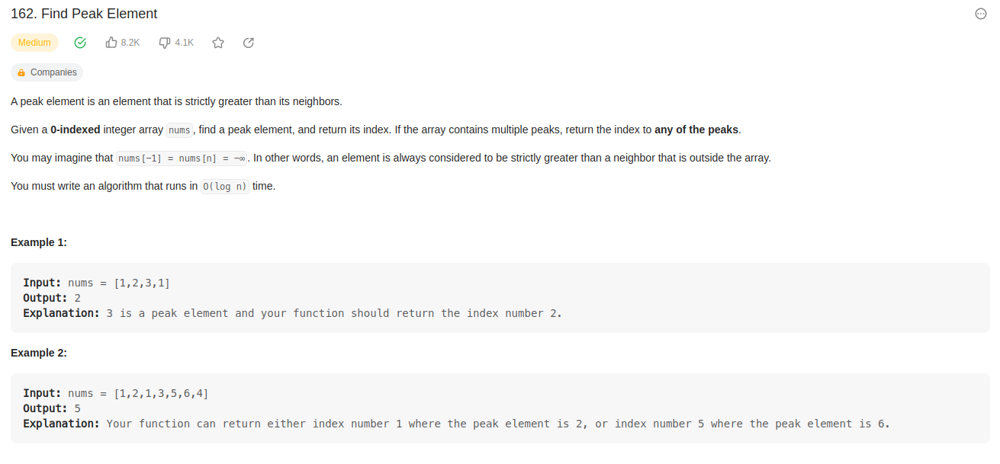
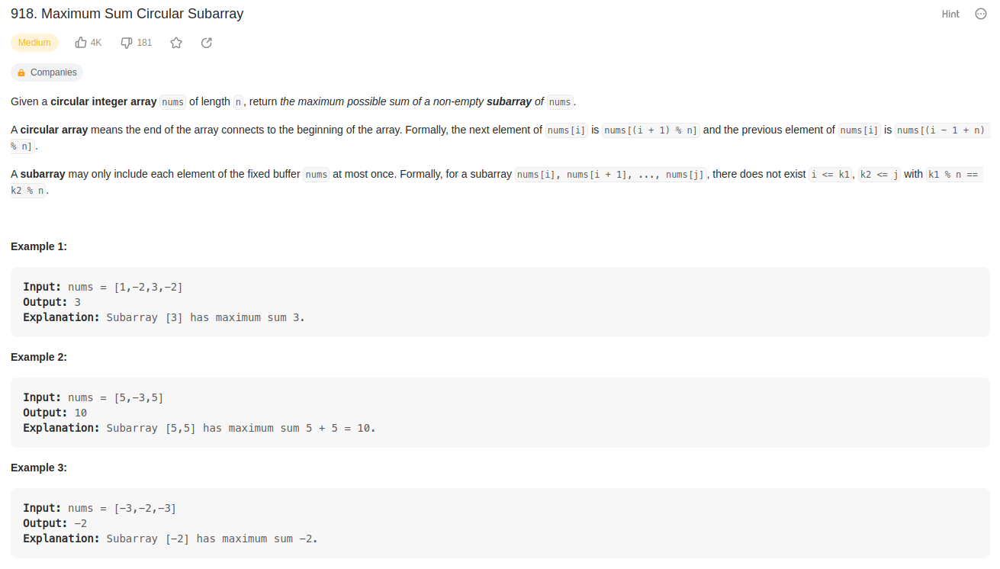
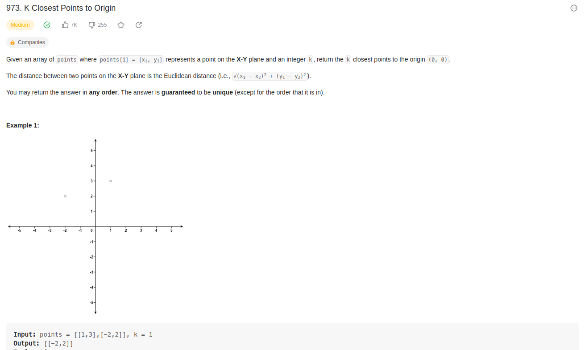
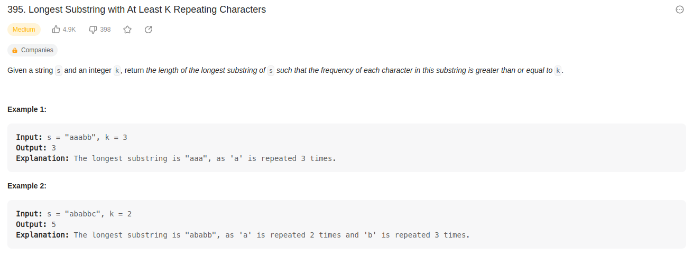

# DC_ExerciciosResolvidos

**Número da Lista**: 3 
**Conteúdo da Disciplina**: Dividir e Conquistar 

## Alunos

| Matrícula  | Aluno                         |
| ---------- | ----------------------------- |
| 17/0013987 | João Victor de Oliveira Matos |
| 17/0011119 | Geraldo Victor Alves Barbosa  |

## Sobre

Exercicios resolvidos sobre o conteúdo de Dividir e Conquistar.

Foram selecionados 4 exercícios de nível médio do site [leetcode](https://leetcode.com/), sendo eles:

-   [Longest substring](https://leetcode.com/problems/longest-substring-with-at-least-k-repeating-characters/description/)
-   [Maximum sum subarray](https://leetcode.com/problems/maximum-sum-circular-subarray/description/)
-   [Find Peak Element](https://leetcode.com/problems/find-peak-element/description/)
-   [K Closest Points to Origin](https://leetcode.com/problems/k-closest-points-to-origin/description/)

## Screenshots

## Apresentação

[Apresentação]()
